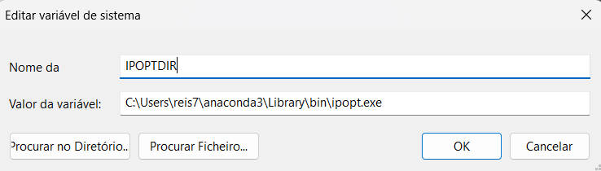

# Getting Started

## Installation
You can begin using SC-OPF in just a few easy steps. First you need to install an IDE, in my case I used Pycharm, which can be installed through [Anaconda](https://www.anaconda.com/download), but you can use another one if you like.
After installing the IDE you will need to install the following necessary libraries: Pyomo and IPOPT.

### Pyomo
[Pyomo](https://www.pyomo.org) is a powerful open-source Python library used for defining and solving mathematical optimization problems. It supports a wide range of optimization types, including linear programming (LP), mixed-integer programming (MIP), nonlinear programming (NLP), and more. Pyomo allows users to build complex optimization models in a flexible and readable way using Python code. It can interface with various solvers like GLPK, CBC, CPLEX, and Gurobi. Pyomo is widely used in academia and industry for operations research, supply chain optimization, energy systems, and engineering applications. Its strength lies in its modeling flexibility and integration with the Python ecosystem.

If you are using Anaconda, install Pyomo through the anaconda prompt:
```
conda install conda-forge::pyomo
```
You can also install it with pip:
```
pip install pyomo
```
### IPOPT
[IPOPT](https://coin-or.github.io/Ipopt/) (Interior Point Optimizer) is an open-source software package for large-scale nonlinear optimization. It is designed to solve problems with continuous variables, including nonlinear programming (NLP) problems that may have thousands or millions of variables and constraints. IPOPT uses an interior-point algorithm and supports sparse matrix techniques for efficient computation. It is particularly effective for smooth, constrained optimization problems in engineering, economics, and scientific computing. IPOPT can be used with modeling languages like Pyomo and AMPL, and integrates with various linear algebra libraries for improved performance.

If you are using Anaconda, install IPOPT through the anaconda prompt:
```
conda install conda-forge::ipopt
```
or
```
conda install -c conda-forge ipopt
```
You can also install it with pip:
```
pip install cyipopt
```
To use IPOPT you will also need to create an environment variable with its location.
To find the corresponding location, run the following code in the anaconda prompt:
```commandline
where ipopt
```
It will return the location of IPOPT, copy that location as it is essential to create the environment variable. Simply search for environment variable when clicking the Windows button.
it should show something like this:

Then, by pressing Edit ("Editar" in portuguese), you can create your environment variable.

All you need to do is add the variable IPOPTDIR, with its corresponding location.


!!! tip "Recommendation"

    We recommend using the [HSL solvers](https://licences.stfc.ac.uk/product/coin-hsl) from UK Research and Innovation, because they are much faster. However, to access them, you need to submit a request with a justification. After approval, you’ll receive a set of packages to download, along with a README file that guides you through the installation process.


With this you are now ready to compile the code! If you don't have it, then here is how you can get access to it.
### Download the code
You can download the code from GitLab or GitHub. There, you’ll find all the auxiliary code and data sources for the various test cases. To run a specific case, you only need to modify the `main.py` file and the corresponding input data files (`.json` and `.xlsx`). For details on how each function works, refer to the [Multi-Period Optimal Power Flow](mp_opf.md) and [Security-Constrained Optimal Power Flow](sc_opf.md) modules.